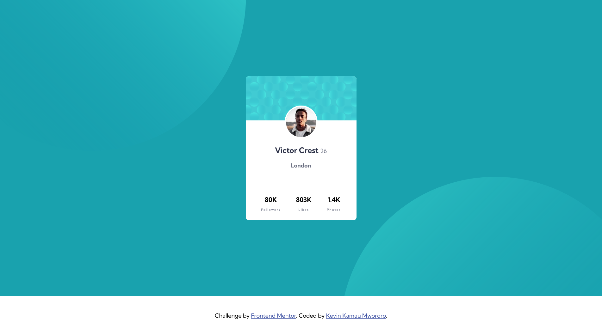

# Frontend Mentor - Profile card component solution

This is a solution to the [Profile card component challenge on Frontend Mentor](https://www.frontendmentor.io/challenges/profile-card-component-cfArpWshJ). Frontend Mentor challenges help you improve your coding skills by building realistic projects. 

## Table of contents

- [Overview](#overview)
  - [The challenge](#the-challenge)
  - [Screenshot](#screenshot)
  - [Links](#links)
- [My process](#my-process)
  - [Built with](#built-with)
  - [What I learned](#what-i-learned)
- [Author](#author)

## Overview

### The challenge

- Build out the project to the designs provided

### Screenshot

### Links

- Solution URL: [codepen](https://codepen.io/mwororokevin/pen/KKXgyjm)
- Live Site URL: [Vercel](https://profile-card-component-rho-five.vercel.app)

## My process

### Built with

- Semantic HTML5 markup
- CSS custom properties
- Flexbox
- Mobile-first workflow

### What I learned

I learned more about background images using CSS.

## Author

- Website - [Kevin Kamau Mwororo](https://mwororokevin.github.io)
- Frontend Mentor - [mwororokevin](https://www.frontendmentor.io/profile/mwororokevin)
